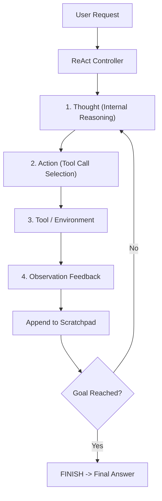

# ReAct Agent Reasoning & Interleaved Tool Engine Skill

High-efficiency, zero-dependency Python implementation of the **ReAct (Reasoning + Acting)** paradigm for autonomous LLM agents.

## Features
- **Interleaved Reasoning & Tool Execution**: Synergizes step-by-step thinking traces with explicit action invocations.
- **Persistent Scratchpad History**: Auditable trajectory tracking across multi-turn interactions.
- **Zero External Dependencies**: Pure Python standard library.
- **Native MCP Protocol**: JSON-RPC 2.0 stdio server compatible with Claude Desktop, Cursor, and Windsurf.

## Architecture

